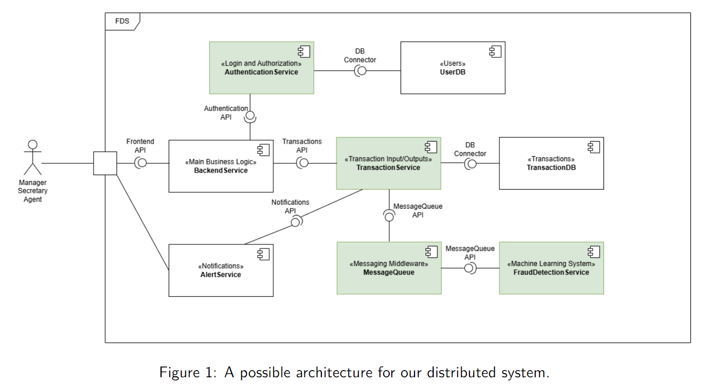

# SS25-dsitributed-systems-assignment

This is the repository for my solution of the SS2025 Distributed Systems course assignment of Informatics BSC at IMC Krems.

The goal of it is to create a complex application with several components, subservices and utilize common APIs, services to connect them, with the theme of a fraud detection banking system.

A possible architecture for it looks as following, defined in the [assignment description](./Assignment_2.pdf):



## Running the application

The application is made up of several services, each with their own methods and custom settings to start with, thus running it can get quite complicated. It is recommended that you start it with the included docker compose.

### Via Docker

Simply run in the root directory of the project:

```bash
docker compose up --build
```

This simply builds the `Dockerfiles` defined in their directories, using the `.env` file next to them.

### Manually

To start a component manually check out the specific subheader for it under the [Project description](#project-description) section.

## Project description

As previously mentioned, this example applications consists of multiple subservices. Here I will now briefly describe each of the implemented services to give a rough idea on the project, but to get to know more details about the specific component, visit the `README` in its directory.

### Authentication Service

Acts as the authentication system for the whole application. At the moment we are using a `stateless authentication` approach, creating a `JWT` token with user details and a specific expiry time, then passing that token via headers in subsequent requests.

The authentication service acts as a gateway that is called by middlewares of other services, making sure that the user has the right level of access for the given query.

To read more about this service, visit its [README file](./authentication_service/README.md).

### Transaction Service

Acts as the main business logic and orchestrator of the whole application. Handles any CRUD operations related to transactions and predicted results of whether the given transaction is fraudulent or not. Exposes API for the frontend of end users to monitor and act upon predictions provided by the fraud detection service. Also exposes a Swagger UI interface for easy interaction.

To read more about this service, visit its [README file](./transaction_service/README.md).

### Backend Service

The backend service is responsible for handling all interactions with the user through the frontend API. It exposes endpoints for the user to interact with the application and forwards those requests to their respective services to be handled, either the `Authentication Service` or the `Transaction Service`. Also exposes a Scalar UI interface for easy interaction and testing.

To read more about this service, visit its [README file](./backend_service/README.md).
